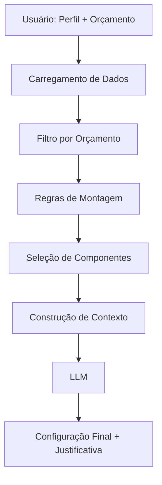

# 🧠 PC Builder AI Agent  
### Sistema Inteligente de Recomendação de PCs (LLM + Dados Estruturados)


---

## 🚀 Visão Geral

O **PC Builder AI Agent** é um sistema inteligente desenvolvido para recomendar configurações completas de computadores com base em:

- Perfil do usuário (gamer, programador, editor, etc.)
- Orçamento disponível
- Dados reais de hardware
- Regras técnicas (compatibilidade, balanceamento, desempenho)

O projeto combina **lógica baseada em dados + inteligência artificial**, simulando um sistema real de recomendação.

---

## 🎯 Problema

Montar um PC ideal não é trivial:

- Usuários não sabem quais peças priorizar  
- Risco de incompatibilidade entre componentes  
- Má distribuição do orçamento  
- Falta de conhecimento técnico  

---

## 💡 Solução

O agente resolve esse problema através de:

- Estruturação de dados de hardware em CSV/JSON  
- Aplicação de regras determinísticas (compatibilidade e prioridades)  
- Uso de IA para refinar decisões e gerar explicações  
- Geração de uma **configuração completa e equilibrada**

---

## 🧠 Como Funciona

### 🔄 Pipeline

Entrada do usuário → Filtro de dados → Regras → Construção de contexto → IA → Recomendação final
---

---
## ▶️ Como Executar o Projeto

Siga os passos abaixo para rodar o agente localmente:

### 1. Clone o repositório

```
git clone https://github.com/seu-usuario/seu-repositorio.git
cd seu-repositorio
```
### 2. Instale as dependências 
```
pip install pandas requests streamlit
```
### 3. Rode o programa
```
streamlit run .\source\app.py
```
### Versão otimizada via IA
```
streamlit run .\source\app_2.0.py
```

---
## ⚙️ Arquitetura

- **Camada de Dados**
  - CSVs com peças de hardware
  - JSON com pesos e regras

- **Camada Lógica (Python)**
  - Filtragem por orçamento  
  - Validação de compatibilidade  
  - Priorização por perfil  

- **Camada de IA (LLM)**
  - Refinamento da decisão  
  - Geração da justificativa  


---

## 🗂️ Estrutura do Projeto
data/
├── cpus.csv
├── gpus.csv
├── ram.csv
├── storage.csv
├── motherboards.csv
├── psu.csv
├── cases.csv
├── profiles.csv
├── build_rules.csv
├── compatibility.csv
└── configuration_weights.json

src/
└── pc_builder_agent.py


---

## 💻 Exemplo de Uso

### Entrada

Perfil: gamer  
Orçamento: 5000  

### Saída

--- CONFIGURAÇÃO RECOMENDADA ---

CPU: Ryzen 5 5600  
GPU: RX 7600  
RAM: 16GB DDR4  
Armazenamento: SSD NVMe 1TB  
Placa-mãe: B550M  
Fonte: 650W 80+ Bronze  
Gabinete: Airflow alto  

Preço total: R$ 4.500,00  

--- JUSTIFICATIVA ---

A GPU foi priorizada para maximizar desempenho em jogos.  
A CPU escolhida evita gargalos e oferece excelente custo-benefício.  
A configuração está equilibrada dentro do orçamento.

---

## 📊 Estratégia de Dados

- Dados baseados no mercado real brasileiro  
- Estrutura otimizada para filtragem com Pandas  
- Contexto reduzido enviado à IA (eficiência de tokens)  

---

## 🧪 Avaliação

### Cenários testados

- Recomendação gamer  
- Recomendação para programador  
- Compatibilidade de peças  
- Falta de contexto  
- Perguntas fora do escopo  

### Resultados

- Alta assertividade  
- Respeito às regras  
- Tratamento correto de edge cases  

---

## ⚠️ Limitações

- Preços não são em tempo real  
- Não considera estoque  
- Compatibilidade simplificada (socket)  
- Performance depende do modelo  

---

## ⚡ Performance

Foram testadas duas versões:

- **Versão 1:** Estrutura básica  
- **Versão 2:** Versão otimizada  

Resultados:

- Ambas corretas  
- Versão otimizada mais rápida  
- Ainda com latência considerável  

Modelo utilizado:

GPT-oss:20b

---

## 🛠️ Tecnologias

- Python  
- Pandas  
- JSON / CSV  
- LLM  

---

## 🧩 Funcionalidades

- Recomendação baseada em orçamento  
- Priorização por perfil  
- Validação de compatibilidade  
- Explicação técnica das escolhas  
- Tratamento de edge cases  

---

## 🧠 Decisões de Projeto

- Abordagem híbrida (regras + IA)  
- Pré-processamento para reduzir custo de IA  
- Separação clara entre lógica e decisão  

---

## 🚀 Melhorias Futuras

- Preços em tempo real  
- Estimativa de FPS  
- Comparação entre builds  
- Interface web (chatbot)  
- Otimização de performance  

---

## 📌 Conclusão

O projeto demonstra:

- Aplicação prática de IA em problema real  
- Integração entre dados estruturados e LLM  
- Capacidade de projetar sistemas escaláveis  

---

## 👨‍💻 Autor
-Antonio Augusto-
Projeto desenvolvido como solução completa de agente inteligente.

---

💡 Projeto desenvolvido com mentalidade de produção: equilíbrio entre performance, custo e qualidade.
